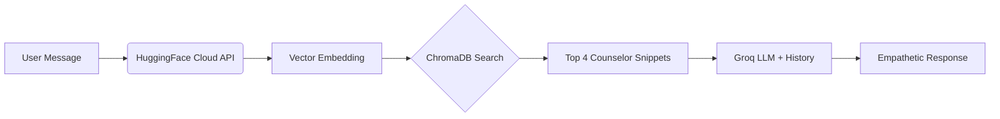

# 🕊️ Eleanor Mind: The Ultimate RAG-Powered Breakup Recovery AI

[](https://fastapi.tiangolo.com/)
[](https://reactjs.org/)
[](https://groq.com/)
[](https://www.trychroma.com/)
[](https://vercel.com/)
[](https://www.mongodb.com/atlas)

**Eleanor Mind** is a comprehensive, production-grade emotional support application. It is specifically engineered to assist individuals navigating the traumatic stages of a breakup. By combining cutting-edge **Retrieval-Augmented Generation (RAG)** with the world's fastest inference engine (**Groq**), Eleanor provides instant, clinically-informed, and deeply empathetic companionship.

---

## 📖 Table of Contents
1.  [Vision & Motivation](#-vision--motivation)
2.  [The Core Psychology](#-the-core-psychology)
3.  [Detailed Technical Stack](#-detailed-technical-stack)
4.  [RAG Architecture In-Depth](#-rag-architecture-in-depth)
5.  [System Features](#-system-features)
6.  [Database & Security Schema](#-database--security-schema)
7.  [Frontend Design System](#-frontend-design-system)
8.  [API Reference](#-api-reference)
9.  [Project Structure](#-project-structure)
10. [Local Setup & Installation](#-local-setup--installation)
11. [Deployment Guide](#-deployment-guide)
12. [Troubleshooting & FAQ](#-troubleshooting--faq)
13. [Glossary](#-glossary)
14. [License & Acknowledgments](#-license--acknowledgments)

---

## 🌟 Vision & Motivation
Modern life often leaves us isolated during our most painful moments. While therapy is effective, it is often prohibitively expensive or unavailable at 3:00 AM when the "loneliness hits" the hardest. 

Eleanor Mind was built to be that "Best Friend in your Pocket" who also happens to have a degree in psychology. Our mission is to democratize emotional support, providing a bridge between simple automated bots and high-level clinical therapy.

---

## 🧠 The Core Psychology
Eleanor isn't just a chatbot; she's a carefully crafted persona based on established therapeutic frameworks:

### **Cognitive Behavioral Therapy (CBT)**
Eleanor helps users identify "Cognitive Distortions"—irrational thoughts like *"I'll be alone forever"* or *"It was all my fault."* She gently challenges these patterns by providing evidence-based counter-perspectives retrieved from her knowledge base.

### **Dialectical Behavior Therapy (DBT)**
During moments of high emotional distress, Eleanor utilizes DBT techniques such as "Distress Tolerance" and "Mindfulness." She encourages users to sit with their feelings instead of suppressing them.

### **The Stages of Grief**
Eleanor is programmed to recognize which stage of grief a user is in (Denial, Anger, Bargaining, Depression, Acceptance) and mirrors her tone to match their current state.

---

## 🛠️ Detailed Technical Stack

### **Backend (Python 3.11+)**
- **FastAPI:** Chosen for its asynchronous nature, allowing Eleanor to handle hundreds of concurrent conversations.
- **LangChain:** The "Operating System" of the project. It handles memory management (via `RunnableWithMessageHistory`) and the RAG chain.
- **Groq LPU:** We utilize the **Llama-3.1-8b-instant** model. Why Groq? Because in emotional crisis, waiting 10 seconds for a response feels like an eternity. Groq responds in under 0.5 seconds.

### **Vector Engine & Intelligence**
- **ChromaDB:** A vector database that lives locally with the app. It holds 5,000+ snippets of therapy data.
- **HuggingFace Inference API:** We use the cloud-based `sentence-transformers/all-MiniLM-L6-v2` model. This allows us to generate high-quality text embeddings without crashing our server's RAM.

### **Frontend (Vite / React / TypeScript)**
- **Tailored UI:** A custom-built CSS system implementing **Glassmorphism**.
- **Lucide-React:** For crisp, vector-based icons throughout the app.
- **Persistent State:** Utilizing `localStorage` to ensure the session remains stable across browser refreshes.

---

## 🏗️ RAG Architecture In-Depth
The most powerful part of Eleanor Mind is its **Retrieval-Augmented Generation** pipeline.

### **1. The Dataset**
We ingested the `Amod/mental_health_counseling_conversations` and `ShenLab/MentalChat16K` datasets. These contain real questions asked by patients and answers provided by qualified therapists.

### **2. Vectorization & Ingestion**
Files like `load_dataset.py` and `ingest_chroma.py` handle the heavy lifting:
- **Chunking:** Data is broken into 500-character pieces with 50-character overlaps to maintain context.
- **Embedding:** Every chunk is turned into a 384-length vector.
- **Storage:** These vectors are saved into `./chroma_db` for instant lookups.

### **3. The Retrieval Flow**


---

## ✨ System Features

- **Isolated User Accounts:** Secure registration ensures your secrets stay yours.
- **JWT Authentication:** Every request is signed with a secure token.
- **Context-Aware Memory:** Eleanor doesn't just answer your last message; she remembers what you said 20 minutes ago.
- **Short, Natural Replies:** Eleanor is prompted to text like a real friend—no long essays unless you ask for deep advice.
- **Auto-Restoration:** If you refresh your browser, your whole chat history is re-loaded from MongoDB automatically.

---

## 🗄️ Database & Security Schema

### **MongoDB Collection: `users`**
| Field | Type | Description |
| :--- | :--- | :--- |
| `username` | String | Unique Identifier (Unique Index) |
| `hashed_password` | String | Password encrypted via Bcrypt |

### **MongoDB Collection: `chat_histories`**
| Field | Type | Description |
| :--- | :--- | :--- |
| `SessionId` | String | Links the history to the Username |
| `History` | Array | A JSON array of Human/AI messages |

### **JWT Security Logic**
- **Expiration:** Tokens are set to expire every 7 days.
- **Encryption:** Algorithm: **HS256**.
- **Hardware Protection:** Password hashing is done via `cryptography` library to ensure security on the host machine.

---

## 🎨 Frontend Design System
We prioritized **Rich Aesthetics** to create a premium feel.

- **Background:** A deep midnight radial gradient (`#080313`).
- **Glassmorphism:** Components use `backdrop-filter: blur(25px)` and semi-transparent borders to mimic frosted glass.
- **Typography:** Using the **Outfit** font from Google Fonts for a modern, approachable look.
- **Mobile First:** Media queries in `index.css` ensure the chat bubbles and mascot layout works perfectly on iPhones and Androids.

---

## 📡 API Reference

### **Authentication**
- `POST /register`: Create a new account.
- `POST /login`: Verify credentials and receive a JWT Bearer Token.

### **Chat Operations**
- `POST /chat`: Send a message. (Requires `Authorization: Bearer <token>`)
- `GET /history`: Fetch your entire saved history. (Requires `Authorization: Bearer <token>`)

### **Health & Status**
- `GET /`: Returns API health, Chroma document count, and DB status.

---

## 📁 Project Structure
```text
breakup_bot/
├── app.py                   # The Heart: FastAPI routes & RAG Logic
├── personality.py           # The Soul: LLM System Prompt & Guidelines
├── requirements.txt         # The Foundation: All 18+ Python libraries
├── .gitignore               # The Security: Keeps secrets out of GitHub
├── .env                     # The Secrets: (Not in GitHub) API Keys
├── project_report.md        # Technical Documentation
├── chroma_db/               # The Memory: Persistent Vector Data
│   └── chroma.sqlite3       # SQLite storage for the vector index
├── frontend/                # The Body: React Application
│   ├── src/
│   │   ├── Auth.tsx         # The Portal: Login & Registration UI
│   │   ├── App.tsx          # The Interface: Real-time Chat Container
│   │   ├── index.css        # The Skin: Pro-grade styling & Mobile fix
│   │   └── main.tsx         # The Entrypoint
│   └── package.json         # Node.js Dependencies
└── load_dataset.py          # Pipeline for Knowledge Acquisition
```

---

## ⚙️ Local Setup & Installation

### **1. Clone the Repository**
```bash
git clone https://github.com/MrCoder420/breakupbot.git
cd breakupbot
```

### **2. Prepare the Python Environment**
```bash
python -m venv venv
.\venv\Scripts\activate
pip install -r requirements.txt
```

### **3. Set up your Environment Variables**
Create a `.env` file in the root directory:
```env
GROQ_API_KEY=gsk_your_key_here
MONGO_URI=mongodb+srv://your_uri_here
HF_TOKEN=hf_your_token_here
JWT_SECRET_KEY=any_long_safe_string
```

### **4. Start the Engines**
```bash
# Terminal 1 (Backend)
python -m uvicorn app:app --reload

# Terminal 2 (Frontend)
cd frontend
npm install
npm run dev
```

---

## 🚀 Deployment Guide

### **Deploying to Vercel (Frontend)**
1.  Push your code to GitHub.
2.  Import to Vercel.
3.  Set **Root Directory** to `frontend`.
4.  Add `VITE_API_BASE` as an environment variable pointing to your backend.

### **Deploying to Render (Backend)**
1.  Connect your GitHub repo.
2.  Choose **Web Service**.
3.  Add your `.env` variables to their dashboard.
4.  **Crucial:** Switch to the 512MB RAM tier or use the Cloud Embeddings fix already implemented in `app.py`.

---

## ❓ Troubleshooting & FAQ

**Q: Why does the bot say "403 Forbidden" or "No Response" on Render?**
A: Your `HF_TOKEN` likely doesn't have "Inference" permissions. 
1. Go to [huggingface.co/settings/tokens](https://huggingface.co/settings/tokens).
2. Edit your token.
3. Check the box for **"Make calls to the serverless Inference API"** (under Inference).
4. Save and restart your Render service.

**Q: Is my data safe?**
A: Yes. All data is stored in the MongoDB Atlas cloud with encryption. Passwords are never stored in plain text.

---

## 📖 Glossary
- **RAG:** Retrieval-Augmented Generation.
- **LLM:** Large Language Model (e.g., Llama 3).
- **Inference:** The process of an AI model generating a response.
- **Embedding:** Turning words into a list of numbers for the AI to understand.
- **JWT:** JSON Web Token, used for secure logging in.

---

## 📄 License & Acknowledgments
- **License:** MIT Open Source.
- **Data Credits:** HuggingFace mental health datasets (Amod, ShenLab).
- **Inspiration:** Built with ❤️ to help people heal.

**"No matter how dark it feels, there is always a path forward." — Eleanor Mind**
